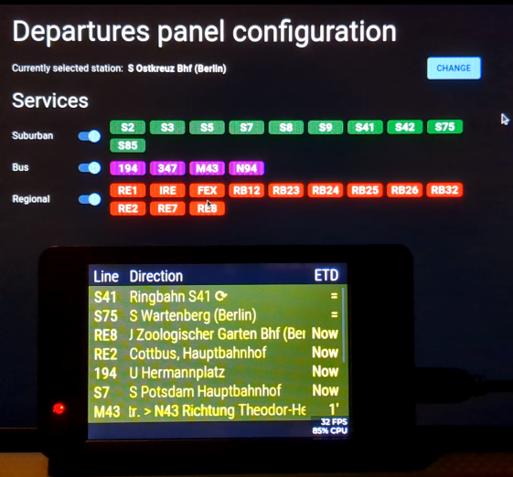

# Welcome to SunTransit

An ESP32 project to monitor departures of the Berliner Verkehrsbetriebe (BVG) using Sunton development boards.

  

## Features

-   Based on Sunton [3248S035C](https://www.openhasp.com/0.7.0/hardware/sunton/esp32-3248s035/) boards (3.5", 480x320px). In the future, support for other boards is planned.
-   WiFi 🛜 provisioning via the "ESP SoftAP Provisioning" app 📱
-   Web based configuration
-   Selection of station to show departures from (BVG)
-   Selection of products to show departures of 🚌🚇🚉🚆

## Acknowledgments

The public transport data comes from the [https://v6.bvg.transport.rest/](https://v6.bvg.transport.rest/) API, show some love to [@derhuerst](https://github.com/derhuerst).
